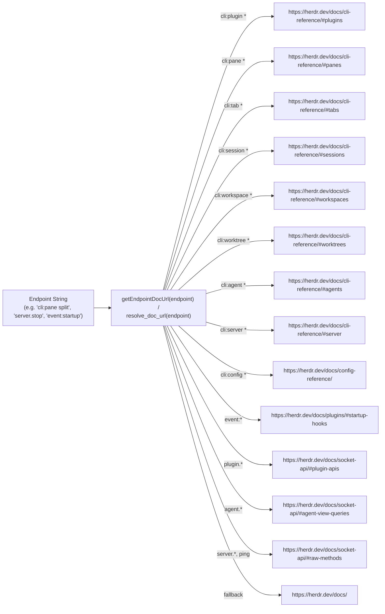

# Herdr Plugins Intelligence & Growth Explorer — Architecture Specification

This document provides the authoritative architectural specification for the **Herdr Plugins Intelligence & Growth Explorer** system, covering the data ingestion pipeline, static code analysis engine, relational SQLite storage layer, backend API service, frontend SPA application, and official documentation routing architecture.

---

## 1. System Overview & Component Topology

The system is designed as a decoupled, multi-tiered static analysis and intelligence platform for the complete ecosystem of **903 published Herdr plugins** from [herdr.dev](https://herdr.dev).

```mermaid
graph TD
    subgraph Upstream["External Ecosystem Sources"]
        HERDR_MKT["herdr.dev/plugins<br/>(Marketplace Index)"]
        GH_REPOS["GitHub Plugin Repositories<br/>(903 Git Clones, 8.7M LOC)"]
        CORE_SPEC["herdrdev/herdr Core<br/>(Rust CLI Spec & JSON Schema)"]
        DOCS_SITE["herdr.dev/docs<br/>(Astro Starlight Documentation)"]
    end

    subgraph Pipeline["Data Ingestion & Static Analysis Pipeline"]
        SYNC["scripts/sync-plugins.js<br/>(Marketplace Scraper)"]
        CLONE["scripts/clone_repos.py<br/>(Parallel Shallow Cloner)"]
        ANALYZER["scripts/analyzer.py<br/>(AST, Regex & Manifest Parser)"]
        CORE_CAT["scripts/catalog_official_endpoints.py<br/>(Official API Cataloger)"]
        GROWTH_COL["scripts/collect_history.py<br/>(36-Week Milestone Extractor)"]
        DAILY_GEN["scripts/daily_report_generator.py<br/>(Chronological Ledger & Report Engine)"]
    end

    subgraph Storage["Relational Storage Layer (SQLite)"]
        DB[("plugins.db<br/>34,884 Milestone Rows<br/>250 Daily Reports • 186 Capabilities")]
        T_PLUGINS["plugins"]
        T_HISTORY["plugin_history"]
        T_OFFICIAL["herdr_official_endpoints"]
        T_ENDPOINTS["plugin_endpoints"]
        T_AGENTS["plugin_agents"]
        T_ITEMS["plugin_manifest_items"]
        T_DAILY["daily_reports (250 Days)"]
        T_LEDGER["ecosystem_capabilities_ledger"]
        T_DRP["daily_report_plugins"]
        DB --- T_PLUGINS
        DB --- T_HISTORY
        DB --- T_OFFICIAL
        DB --- T_ENDPOINTS
        DB --- T_AGENTS
        DB --- T_ITEMS
        DB --- T_DAILY
        DB --- T_LEDGER
        DB --- T_DRP
    end

    subgraph Backend["API & Query Service"]
        EXPRESS["server.js (Node Express)<br/>Port 3000"]
        API_PLUGINS["/api/plugins (Filters, Sort, Pagination)"]
        API_STATS["/api/stats (Ecosystem Aggregates, Endpoints & Summary)"]
        API_HISTORY["/api/history (36-Week Timeseries Matrix)"]
        API_REPORTS["/api/daily-reports (Chronological Dispatch & Breakthroughs)"]
        API_RELEASES["/api/releases (Weekly Ingestion Cadence)"]
        API_QUERY["/api/query (Read-Only SQL Console)"]
        EXPRESS --- API_PLUGINS
        EXPRESS --- API_STATS
        EXPRESS --- API_HISTORY
        EXPRESS --- API_REPORTS
        EXPRESS --- API_RELEASES
        EXPRESS --- API_QUERY
    end

    subgraph Frontend["Client SPA Application (public/)"]
        APP["public/app.js (Vanilla ES2022)"]
        INDEX["public/index.html (Semantic HTML5)"]
        STYLE["public/style.css (Catppuccin Ink Theme)"]
        REPORTS_VIEW["📰 Daily Reports View<br/>(Reverse-Chronological Virtual Scroll, Newspaper Layout)"]
        STICKY["Sticky Controls & Collapsible Drawer<br/>(Dynamic --nav-height, Sentinel Detection)"]
        ECHARTS["Apache ECharts Engine<br/>(Pixel-to-Data Coordinate Mapping, Smooth Tooltips)"]
        DOC_ROUTER["Documentation Deep-Link Router<br/>(herdr.dev/docs/ Resolver)"]
    end

    HERDR_MKT --> SYNC
    GH_REPOS --> CLONE --> ANALYZER
    CORE_SPEC --> CORE_CAT
    GH_REPOS --> GROWTH_COL

    SYNC --> DB
    ANALYZER --> DB
    CORE_CAT --> DB
    GROWTH_COL --> DB

    DB <--> EXPRESS
    EXPRESS <--> APP
    INDEX --- APP
    STYLE --- APP
    APP --- STICKY
    APP --- ECHARTS
    APP --- DOC_ROUTER
    DOC_ROUTER --> DOCS_SITE
```



---

## 2. Ingestion & Static Analysis Pipeline

The offline pipeline transforms raw repository code and marketplace metadata into rich, queryable intelligence records.

### 2.1 Repository Cloning & Mirroring
- **Shallow Parallel Cloning (`scripts/clone_repos.py`)**: Uses Python worker pools (`concurrent.futures.ThreadPoolExecutor`) to execute shallow clones (`--depth 1 --single-branch`) into `repos/<owner>__<repo>`.
- Total storage footprint: ~1.7 GB across 903 repositories.
- `repos/` is excluded from git version control via `.gitignore`.

### 2.2 Static Analysis & Feature Extraction (`scripts/analyzer.py`)
Static analysis traverses all 8.7M lines of code without executing arbitrary plugin binaries:
1. **Manifest Parsing**: Discovers and deserializes `herdr-plugin.toml` files at repository roots or nested plugin subdirectories. Extracts plugin ID, name, description, author, version, minimum Herdr version, actions, keybindings, links, and entrypoint terminal panes.
2. **Language & LOC Breakdown**: Classifies every source file by file extension and counts lines of code, blank lines, and comments. Identifies the primary language and secondary polyglot breakdown.
3. **⚡ Raw Socket API Detection (`uses_raw_socket`)**:
   - Detects direct connections to `$HERDR_SOCKET_PATH` (Unix domain socket).
   - Scans for IPC socket transports (`UnixStream`, `net.createConnection`, `tokio::net::UnixStream`, `socket.AF_UNIX`).
   - Identifies raw RPC method invocations (e.g. `server.stop`, `window.focus`, `pane.read`).
   - **Result**: 352 plugins (39.0%) establish direct socket connections.
4. **🧩 Agent Skill Integration Detection (`uses_agent_skills`)**:
   - Inspects directory structures for `SKILL.md`, `.claude/skills/`, `.opencode/skills/`, `.cursor/skills/`, or agent capability manifests.
   - Scans for agent lifecycle hooks, task execution handoffs, and context-sharing protocols.
   - **Result**: 228 plugins (25.2%) bundle AI agent skills or automation hooks.
5. **Remote Infrastructure Requirements**:
   - Evaluates static code and configuration files for SSH tunnels, Mosh, WireGuard/Tailscale VPN, UPnP port forwarding, NAT router traversal, and cloud VPS gateways.
   - **Result**: 219 plugins (24.2%) require or configure remote networking infrastructure.
6. **Interface Form Factors**: Classifies plugins into TUI (Terminal User Interface via ratatui, bubbletea, ink), Web Display (browser windows or WebSockets), and External Comms (Telegram, Discord, push notifications).

### 2.3 Official Core Endpoint Cataloger (`scripts/catalog_official_endpoints.py`)
Parses the official Herdr Core engine (`repos/herdrdev__herdr`):
- Reads `herdr-api.schema.json` to extract all 101 official JSON-RPC socket methods and 29 lifecycle event hooks.
- Parses Rust CLI specifications (`src/cli/spec.rs`) using regex AST extractors to catalog all 103 official CLI subcommands and options.
- Correlates official endpoints with community plugin usage in `plugin_endpoints` to identify **100 Zero-Usage Endpoints (42.9%)** that have never been called by any community plugin.

---

## 3. Storage Layer & Database Schema

The database is implemented in **SQLite 3** (`plugins.db`) with WAL (Write-Ahead Logging) mode enabled for concurrent read-only queries and high-speed analytical aggregation.

### 3.1 Primary Schema Tables

```sql
-- Main plugin catalog (50+ attributes)
CREATE TABLE plugins (
    id TEXT PRIMARY KEY,
    repo_full_name TEXT UNIQUE,
    name TEXT,
    owner TEXT,
    description TEXT,
    primary_language TEXT,
    broad_category TEXT,
    sub_category TEXT,
    stars INTEGER,
    forks INTEGER,
    open_issues INTEGER,
    stars_delta_7d INTEGER,
    total_loc INTEGER,
    file_count INTEGER,
    uses_raw_socket INTEGER DEFAULT 0,
    raw_socket_details TEXT,
    uses_agent_skills INTEGER DEFAULT 0,
    agent_skills_details TEXT,
    remote_infra_required INTEGER DEFAULT 0,
    remote_infra_type TEXT,
    has_tests INTEGER DEFAULT 0,
    is_cross_platform INTEGER DEFAULT 0,
    herdr_socket_methods TEXT,     -- JSON array of strings
    herdr_cli_commands TEXT,       -- JSON array of strings
    created_at TIMESTAMP,
    updated_at TIMESTAMP
);

-- 36-week historical timeline milestones (32,508 rows)
CREATE TABLE plugin_history (
    plugin_id TEXT,
    week_date TEXT,
    stars INTEGER,
    forks INTEGER,
    commits INTEGER,
    PRIMARY KEY (plugin_id, week_date),
    FOREIGN KEY(plugin_id) REFERENCES plugins(id)
);

-- Official Herdr Core API catalog (233 rows)
CREATE TABLE herdr_official_endpoints (
    endpoint TEXT PRIMARY KEY,
    endpoint_type TEXT,            -- 'cli_command' | 'socket_method' | 'event_hook'
    category TEXT,
    description TEXT,
    doc_url TEXT                   -- https://herdr.dev/docs/...
);

-- Inverted index of plugin-to-endpoint usage
CREATE TABLE plugin_endpoints (
    plugin_id TEXT,
    endpoint TEXT,
    source_type TEXT,
    PRIMARY KEY (plugin_id, endpoint),
    FOREIGN KEY(plugin_id) REFERENCES plugins(id)
);
```

### 3.2 Dynamic Column Migration (`scripts/db_manager.py`)
The `db_manager.ensure_columns()` utility introspects table column metadata (`PRAGMA table_info(plugins)`) at runtime. When new static analysis heuristics are introduced, it executes non-destructive `ALTER TABLE plugins ADD COLUMN <col> <type>` statements automatically without requiring database recreation.

---

## 4. Backend Server Architecture (`server.js`)

The backend is a lightweight Node.js Express server running on port `3000` with strict read-only guarantees.

### 4.1 API Endpoints Specification

| Route | HTTP | Description | Query Parameters / Payload |
|---|---|---|---|
| `/api/stats` | `GET` | Aggregate ecosystem metrics, top official endpoints, all endpoints catalog, and zero-usage breakdown | None |
| `/api/plugins` | `GET` | Filtered, sorted, paginated plugin records | `q`, `category`, `language`, `agent`, `sort`, `raw_socket`, `agent_skills`, `remote_infra`, `ssh`, `mosh`, `vpn`, `tui`, `mobile`, `web` |
| `/api/plugins/:id` | `GET` | Full single-plugin detail record with manifest items | `id` (repository identifier) |
| `/api/history` | `GET` | 36-week historical growth timeseries matrix for Apache ECharts | `metric` (`stars`, `velocity`, `commits`), `limit`, `skip` |
| `/api/releases` | `GET` | Weekly release cadence data (new vs cumulative) | None |
| `/api/query` | `POST` | Read-only SQL executor for live console | JSON: `{"sql": "SELECT ... FROM plugins ..."}` |

### 4.2 Security Constraints on Live SQL
- Queries executed through `/api/query` are strictly validated:
  - Must begin with `SELECT` or `PRAGMA` (case-insensitive).
  - Mutating keywords (`INSERT`, `UPDATE`, `DELETE`, `DROP`, `ALTER`, `TRUNCATE`, `REPLACE`, `ATTACH`, `DETACH`) are rejected.
  - Multi-statement scripts separated by semicolons are stripped or rejected to prevent SQL injection or schema alteration.

---

## 5. Frontend SPA Architecture (`public/`)

The client application is built as a zero-dependency, modern Vanilla JavaScript SPA (ES2022) with a custom **Catppuccin Macchiato Ink** dark design system.

### 5.1 Sticky Controls Bar & Collapsible Drawer Mechanics

To provide an optimal browsing experience across 903 cards, the controls bar anchors to the top while scrolling, and the filter pills collapse to preserve vertical viewport space.

```
┌────────────────────────────────────────────────────────┐
│ .hd-nav (position: sticky, top: 0, z-index: 100)       │
└────────────────────────────────────────────────────────┘
┌────────────────────────────────────────────────────────┐
│ #controls-sentinel (1px geometric trigger point)       │
└────────────────────────────────────────────────────────┘
┌────────────────────────────────────────────────────────┐
│ .controls-bar (position: sticky, top: var(--nav-height)│
│  ├── Search input, dropdowns, [🏷️ Filter Pills (N) ▾] │
│  └── .filter-chips-wrapper (max-height: 0 when sticky) │
└────────────────────────────────────────────────────────┘
┌────────────────────────────────────────────────────────┐
│ #plugins-container (cards scroll smoothly UNDER bar)   │
└────────────────────────────────────────────────────────┘
```

1. **Dynamic Navigation Height (`--nav-height`)**:
   - The navigation bar (`.hd-nav`) height varies dynamically depending on viewport width (~58px on desktop, ~95px on wrapped mobile).
   - JavaScript listens to load and resize events, dynamically setting:
     ```javascript
     const h = hdNav.offsetHeight;
     document.documentElement.style.setProperty('--nav-height', `${h}px`);
     ```
   - `.controls-bar` is styled with `position: sticky; top: var(--nav-height); z-index: 90;`, ensuring flush docking below the navbar on all device sizes.
2. **Geometric Sentinel Detection (`#controls-sentinel`)**:
   - An invisible 1px sentinel element is positioned directly above `.controls-bar`.
   - On window scroll, `sentinel.getBoundingClientRect().top <= navH` detects the exact pixel threshold where the bar docks.
3. **Automatic Pill Collapse & Re-Expansion**:
   - When entering sticky mode, `.controls-bar.is-sticky` is applied with elevation shadow (`box-shadow: 0 10px 30px rgba(0, 0, 0, 0.65)`) and backdrop blur (`14px`).
   - The filter pills drawer (`#filter-chips-wrapper`) collapses smoothly to `max-height: 0; opacity: 0; pointer-events: none;`.
   - When scrolling back to the top of the page, the drawer automatically re-expands to full height.
4. **Manual Override & Active Badge Counter**:
   - Users can manually expand or collapse the pill drawer at any time via `#toggle-chips-btn`.
   - Manual expansion while sticky is respected and not abruptly collapsed during subsequent scroll micro-events.
   - When filters are active, `#chips-active-badge` renders a high-contrast badge counter and highlights the toggle button with spot glow, ensuring visibility even when collapsed.

### 5.2 Growth Timeline ECharts Visualizer

The Growth view visualizes 36-week longitudinal adoption curves using Apache ECharts.

1. **Pixel-to-Data Coordinate Mapping**:
   - By default, ECharts only triggers item tooltips when the cursor hovers directly over discrete milestone markers.
   - To provide fluid hovering along continuous polyline curves between milestone dots, a custom coordinate mapper was engineered:
     ```javascript
     const pt = growthChartInstance.convertFromPixel({ seriesIndex }, [e.offsetX, e.offsetY]);
     const milestoneIdx = Math.max(0, Math.min(weeks.length - 1, Math.round(pt[0])));
     growthChartInstance.dispatchAction({
       type: 'showTip',
       seriesIndex: e.seriesIndex,
       dataIndex: milestoneIdx,
       x: e.offsetX,
       y: e.offsetY
     });
     ```
2. **Tooltip Persistence & Hover Debounce**:
   - Prevents premature tooltip dismissal when the mouse slides across series boundaries.
   - Suppresses disruptive point outline flash animations by avoiding redundant `highlight` action triggers on every pixel change.
3. **Interactive Inspection Drawer**:
   - Clicking any milestone point or line curve directly dispatches `showPluginDetail(plugin)` to open the comprehensive plugin inspection drawer.

---

## 6. Official Herdr Documentation Routing Architecture

To prevent broken links and 404 errors, all CLI commands, socket methods, and event hooks are routed to the official documentation website at `https://herdr.dev/docs/` (powered by Astro Starlight).



### 6.1 Routing Table Specification

| Endpoint Pattern | Category | Official Target URL |
|---|---|---|
| `cli:plugin *`, `plugin *` | CLI Command | `https://herdr.dev/docs/cli-reference/#plugins` |
| `cli:pane *`, `pane *` | CLI Command | `https://herdr.dev/docs/cli-reference/#panes` |
| `cli:tab *`, `tab *` | CLI Command | `https://herdr.dev/docs/cli-reference/#tabs` |
| `cli:session *`, `session *` | CLI Command | `https://herdr.dev/docs/cli-reference/#sessions` |
| `cli:workspace *`, `workspace *` | CLI Command | `https://herdr.dev/docs/cli-reference/#workspaces` |
| `cli:worktree *`, `worktree *` | CLI Command | `https://herdr.dev/docs/cli-reference/#worktrees` |
| `cli:agent *`, `cli:report-agent *` | CLI Command | `https://herdr.dev/docs/cli-reference/#agents` |
| `cli:server *`, `server *` | CLI Command | `https://herdr.dev/docs/cli-reference/#server` |
| `cli:notification *` | CLI Command | `https://herdr.dev/docs/cli-reference/#notifications` |
| `cli:status *` | CLI Command | `https://herdr.dev/docs/cli-reference/#launch-and-status` |
| `cli:completion *` | CLI Command | `https://herdr.dev/docs/cli-reference/#shell-completions` |
| `cli:terminal *`, `cli:attach *` | CLI Command | `https://herdr.dev/docs/cli-reference/#direct-terminal-attach` |
| `cli:wait *` | CLI Command | `https://herdr.dev/docs/cli-reference/#output-waits` |
| `cli:integration *` | CLI Command | `https://herdr.dev/docs/cli-reference/#integrations` |
| `cli:config *` | CLI Command | `https://herdr.dev/docs/config-reference/` |
| `event:*` | Event Hook | `https://herdr.dev/docs/plugins/#startup-hooks` |
| `plugin.*` | Socket Method | `https://herdr.dev/docs/socket-api/#plugin-apis` |
| `agent.*` | Socket Method | `https://herdr.dev/docs/socket-api/#agent-view-queries` |
| `pane.read*`, `read.*` | Socket Method | `https://herdr.dev/docs/socket-api/#reading-panes` |
| `wait.*` | Socket Method | `https://herdr.dev/docs/socket-api/#waiting-for-state` |
| `server.*`, `ping` | Socket Method | `https://herdr.dev/docs/socket-api/#raw-methods` |
| Top Navbar "Herdr Docs ↗" | Global Docs | `https://herdr.dev/docs/` |

> [!NOTE]
> For the complete empirical census of all 233 official endpoints, Top 30 adoption rankings across the 903 community plugins, and deep architectural analysis of the 100 zero-usage endpoints, refer to **[`API_USAGE.md`](./API_USAGE.md)**.

---

## 7. Version Control & Contribution Guidelines

- The primary branch is `main`.
- Development features must use feature branches (e.g. `feat/sticky-collapsible-controls`, `fix/herdr-website-docs-links`).
- Commits must adhere to Conventional Commits: `feat:`, `fix:`, `docs:`, `chore:`, `refactor:`.
- The database `plugins.db` is tracked in the repository with complete index data, while raw checkout mirrors under `repos/` and `node_modules/` remain gitignored.
